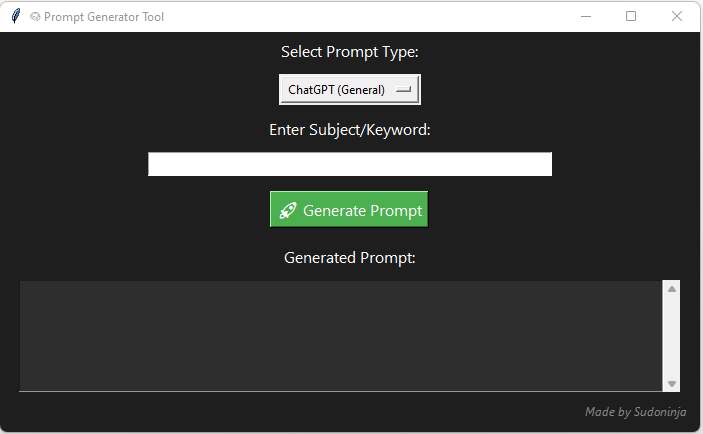

# 🧠 Prompt Generator Tool (GUI Based)

A simple Python GUI tool that helps generate high-quality prompts for AI tools like ChatGPT, Midjourney, SEO writing, cybersecurity reporting, and more.

## ✨ Features

- GUI built with Tkinter
- Multiple prompt categories (Chat, Bug Bounty, SEO, Resume, etc.)
- Custom subject/keyword input
- Prompt auto-copied to clipboard
- Clean dark-themed UI
- Signature: "Made by Sudoninja" in bottom-right

## 📸 Screenshot



## 🚀 Getting Started

### Prerequisites

- Python 3.6+
- Install required packages:

```bash
pip install -r requirements.txt

📂 File Structure
graphql
Copy
Edit
├── prompt_generator.py    # Main Python script
├── README.md              # This readme file
├── requirements.txt       # Python dependencies
└── screenshot.png         # (Optional) Screenshot for GitHub preview
🔧 Dependencies
tkinter (default in Python)

pyperclip

📃 License
MIT License

🧑‍💻 Made with ❤️ by Sudoninja
